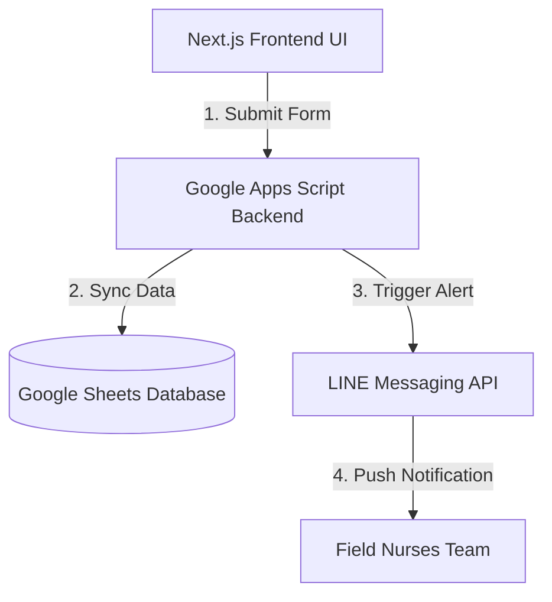

<h1 align="center">Healthcare Registration App </h1>

<p align="center">
  <strong>Modern Digital Intake Platform for Community Healthcare</strong><br>
  <sub>Streamlining patient registration, lookup, and communication for real-world clinical workflows</sub>
</p>

<p align="center">
  
  
  
</p>

<p align="center">
  
</p>

---

## 🧠 The Problem

Community healthcare teams still rely heavily on manual patient intake processes:

- Paper-based registration slows down operations
- Patient lookup is time-consuming and error-prone
- Communication between staff and patients is fragmented
- Data inconsistency across systems

---

## 💡 The Solution

**Patient Intake System** digitizes and automates the intake workflow:

- Instant patient registration
- Fast patient lookup
- LINE-based communication
- Real-time synchronization with Google Sheets

Designed specifically for **field nurses and municipal healthcare teams**

---

## ⚙️ Core Features

- 🧑‍⚕️ Patient Registration
- 🔍 Instant Patient Lookup
- 💬 LINE Messaging Integration
- 📊 Real-time Google Sheets Sync
- 🔔 Automated Appointment Notification
- ⚡ Lightweight UI (Next.js)

---

## 📈 Impact

- ⬇ Reduced manual data entry workload
- ⬆ Improved intake speed
- ⬆ Increased data accuracy
- 🏥 Applied in municipal healthcare workflows

---

## 🧱 Tech Stack

- **Frontend:** Next.js
- **Backend Services:** Google Apps Script
- **Messaging:** LINE Messaging API
- **Database:** Google Sheets
- **UI Framework:** Tailwind CSS

---

## 📊 Google Sheets Schema

To set up the database, create a Google Sheet with the following **exact headers** in the first row (Row 1):


| Column | Header Name (TH) | Key Mapping (JSON) | Type |
| :--- | :--- | :--- | :--- |
| **A** | เลขบัตรประจำตัวประชาชน | `citizenId` | String (Text) |
| **B** | วัน-เวลาที่ลงทะเบียน | `registrationTime` | DateTime |
| **C** | ชื่อ | `firstName` | String |
| **D** | นามสกุล | `lastName` | String |
| **E** | เพศ | `gender` | String |
| **F** | วันเกิด | `birthDate` | Date (YYYY-MM-DD) |
| **G** | เบอร์โทร | `phoneNumber` | String |
| **H** | การแพ้ยา | `drugAllergies` | String |
| **I** | อาการ/สิ่งที่ต้องการรับบริการ | `symptoms` | String (Text) |
| **J** | น้ำหนัก | `weight` | Number |
| **K** | ส่วนสูง | `height` | Number |
| **L** | อายุ | `age` | Number |
| **M** | สิทธิการรักษา | `medicalCoverage` | String |
| **N** | วันนัดถัดไป | `nextAppointmentDate` | Date |
| **O** | เวลานัดถัดไป | `nextAppointmentTime` | Time |
| **P** | แผนก | `department` | String |
| **Q** | ชื่อแพทย์ที่นัดหมาย | `doctorName` | String |
| **R** | สถานะ | `status` | String |

---

## 🔌 Integrations & API Endpoints

### 🟢 LINE Messaging API
Used to notify healthcare staff automatically.

```http
POST /v2/bot/message/push
```

### 🔵 Google Apps Script Web App
Used for patient registration, lookup, dashboard data, and appointment workflows.

```http
GET  /exec
POST /exec
```

**Supported Actions (Query Parameters):**
* `register_new`
* `register_existing`

---

## 📖 API Usage Examples

### 1. Patient Registration (Google Apps Script)
To register a new patient via the Google Apps Script backend Web App module.

**Request Payload (`POST /exec?action=register_new`)**
```json
{
  "citizenId": "1100000000000",
  "firstName": "John",
  "lastName": "Doe",
  "gender": "Male",
  "birthDate": "1990-01-01",
  "phoneNumber": "0812345678",
  "drugAllergies": "None",
  "symptoms": "Mild fever and cough for 2 days",
  "weight": 70,
  "height": 175,
  "age": 36,
  "medicalCoverage": "สิทธิบัตรทอง",
  "status": "Pending"
}
```

**Response (`200 OK`)**
```json
{
  "status": "success",
  "message": "Patient registered successfully",
  "data": {
    "patientId": "HN-2026-0001",
    "registrationTime": "2026-05-29T06:30:00.000Z"
  }
}
```

---

### 2. Staff Notification (LINE Messaging API)
Triggered automatically when a new patient registers to alert the field nurses.

**Request Payload (`POST /v2/bot/message/push`)**
```json
{
  "to": "your_line_admin_user_id",
  "messages": [
    {
      "type": "text",
      "text": "🚨 New Telemedicine Registration!\nName: John Doe\nSymptoms: Mild fever and cough for 2 days.\nPlease review the lookup queue."
    }
  ]
}
```

---

## 🏗 System Flow



---

## 🚀 Getting Started

### Prerequisites
* Node.js (v18 or higher)
* npm or yarn

### Google Apps Script Setup
1. Create a new Google Sheet and set up headers as specified in the **Google Sheets Schema**.
2. Navigate to **Extensions** > **Apps Script**.
3. Paste your backend script into `Code.gs`.
4. Click **Deploy** > **New deployment**.
5. Select **Web app**, set *Execute as* to **Me**, and *Who has access* to **Anyone**.
6. Copy the generated **Web app URL** for the environment setup.

### Installation Steps

1. Clone the repository:
   ```bash
   git clone https://github.com/ratchanon-noknoy2318/healthcare-registration-nextjs.git
   ```

2. Navigate into the project directory:
   ```bash
   cd healthcare-registration-nextj
   ```

3. Install project dependencies:
   ```bash
   npm install
   ```

4. Create a `.env.local` file in the root directory and configure your credentials:
   ```env
   CHANNEL_ACCESS_TOKEN=your_line_channel_access_token
   ADMIN_USER_ID=your_line_user_id
   APPS_SCRIPT_WEB_APP_URL=your_google_apps_script_web_app_url
   ```

5. Run the development server:
   ```bash
   npm run dev
   ```

Open [http://localhost:3000](http://localhost:3000) with your browser to see the result.

---

## 🏛️ Real-World Deployment

This system was officially deployed and utilized by the **Kamphaeng Phet Municipal Government** to modernize public healthcare workflows:

*   **Official Verification:** Deployed as the core framework for local public health initiatives, officially recognized by the Mayor and municipal executives ([View Government Report](https://www.kppmu.go.th/news-detail?hd=1&id=124000)).
*   **Target Users:** Actively used by municipal field nurses, healthcare staff, and community health volunteers to bridge communication gaps.
*   **Zero-Training Success:** Transitioned traditional administrative hurdles into a friction-free intake workflow, leveraging familiar channels like LINE without requiring formal software training for staff or patients.

---

## 📄 License

This project is licensed under the MIT License - see the [LICENSE](LICENSE) file for details.
